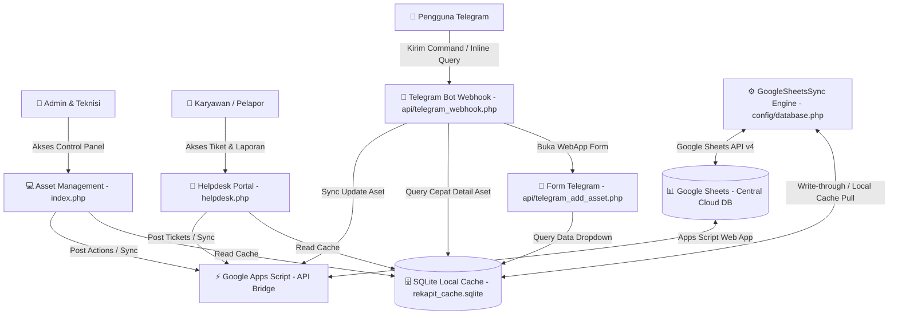

# 🌐 Ekosistem Rekap IT - Asset Management, Helpdesk, & Telegram Bot

**Rekap IT** adalah suite aplikasi manajemen infrastruktur IT all-in-one yang dirancang untuk melacak inventaris aset perangkat keras, memantau operasional pemeliharaan, serta menyediakan portal pelaporan tiket kerusakan (Helpdesk) untuk karyawan. 

Ekosistem ini dioptimalkan sepenuhnya untuk berjalan secara serverless di cloud (**Vercel**) dengan memanfaatkan **Google Sheets** sebagai database cloud utama (Write-Through) dan **SQLite** lokal sebagai cache pembacaan super cepat (Read-Cache).

---

## 🏗️ Diagram Arsitektur & Alur Data

Berikut adalah visualisasi bagaimana portal web, Telegram bot, database SQLite cache lokal, dan database utama Google Sheets berinteraksi di dalam ekosistem Rekap IT:



---

## 🖥️ 4 Pilar Sub-Website & Portals Utama

Ekosistem Rekap IT membagi fungsionalitas sistem ke dalam 4 modul/sub-website utama yang saling terintegrasi:

### 1. Portal Manajemen Aset & Inventaris (Admin & Teknisi)
Merupakan dashboard utama bagi tim IT Infrastructure untuk memantau, mendistribusikan, dan memelihara aset perangkat keras di seluruh cabang perusahaan.
*   **Halaman Utama (Entry Point):** [index.php](file:///c:/Users/MIS%20&%20IT/Downloads/RekapIT-Vercel-main%20%284%29/RekapIT-Vercel-main/index.php) (diarahkan ke [dashboard.php](file:///c:/Users/MIS%20&%20IT/Downloads/RekapIT-Vercel-main%20%284%29/RekapIT-Vercel-main/views/dashboard.php))
*   **Fitur Utama:**
    *   **Dashboard Statistik:** Ringkasan kondisi operasional IT secara real-time (Total Aset, Kondisi Baik/Rusak, Maintenance berjalan, Estimasi biaya repair).
    *   **Data Inventaris:** CRUD aset ([inventaris.php](file:///c:/Users/MIS%20&%20IT/Downloads/RekapIT-Vercel-main%20%284%29/RekapIT-Vercel-main/views/inventaris.php)) dengan detail spesifikasi, serial number, kondisi fisik, kepemilikan karyawan, dan foto aset.
    *   **Pemeliharaan (Maintenance):** Pencatatan inspeksi rutin berkala ([maintenance.php](file:///c:/Users/MIS%20&%20IT/Downloads/RekapIT-Vercel-main%20%284%29/RekapIT-Vercel-main/views/maintenance.php)) dengan filter cerdas bulan berjalan untuk menghindari duplikasi.
    *   **Perbaikan (Repair):** Penanganan kendala/kerusakan perangkat, estimasi biaya, penggunaan sparepart, hingga status penyelesaian tiket ([perbaikan.php](file:///c:/Users/MIS%20&%20IT/Downloads/RekapIT-Vercel-main%20%284%29/RekapIT-Vercel-main/views/perbaikan.php)).
    *   **Audit & Mutasi:** Riwayat perpindahan kepemilikan/lokasi aset serta audit pencocokan data sistem dengan fisik di lapangan ([mutasi.php](file:///c:/Users/MIS%20&%20IT/Downloads/RekapIT-Vercel-main%20%284%29/RekapIT-Vercel-main/views/mutasi.php), [audit.php](file:///c:/Users/MIS%20&%20IT/Downloads/RekapIT-Vercel-main%20%284%29/RekapIT-Vercel-main/views/audit.php)).
    *   **Laporan & Audit Log:** Ekspor laporan operasional ke Excel/PDF ([laporan.php](file:///c:/Users/MIS%20&%20IT/Downloads/RekapIT-Vercel-main%20%284%29/RekapIT-Vercel-main/views/laporan.php)) dan perekaman aktivitas pengguna ([logs.php](file:///c:/Users/MIS%20&%20IT/Downloads/RekapIT-Vercel-main%20%284%29/RekapIT-Vercel-main/views/logs.php)).

### 2. Portal Helpdesk & Tiket IT (Karyawan / Pelapor)
Portal mandiri bagi karyawan di luar tim IT untuk melaporkan kerusakan hardware/software secara mandiri, melacak kemajuan penanganan, dan berdiskusi langsung dengan teknisi.
*   **Halaman Utama (Entry Point):** [helpdesk.php](file:///c:/Users/MIS%20&%20IT/Downloads/RekapIT-Vercel-main%20%284%29/RekapIT-Vercel-main/helpdesk.php) (login menggunakan [helpdesk_login.php](file:///c:/Users/MIS%20&%20IT/Downloads/RekapIT-Vercel-main%20%284%29/RekapIT-Vercel-main/helpdesk_login.php))
*   **Fitur Utama:**
    *   **Pembuatan Tiket:** Formulir cepat untuk melaporkan keluhan lengkap dengan pemilihan aset bermasalah, tingkat prioritas, dan kontak pelapor.
    *   **Pencarian Tiket:** Fitur pelacakan riwayat keluhan berdasarkan Nomor Tiket unik.
    *   **Kolom Diskusi Interaktif:** Ruang obrolan internal di dalam tiket antara pelapor dan teknisi untuk memperjelas kendala/solusi.
    *   **Auto Telegram Notification:** Mengirimkan notifikasi instan ke grup/channel Telegram internal tim IT setiap ada tiket baru masuk atau komentar baru yang dikirimkan.

### 3. Integrasi Telegram Bot (Interactive Assistant)
Menyediakan interface obrolan (chat interface) untuk mengelola aset, mendaftarkan pemeliharaan, serta melakukan pencarian database secara mobile.
*   **Webhook Handler:** [telegram_webhook.php](file:///c:/Users/MIS%20&%20IT/Downloads/RekapIT-Vercel-main%20%284%29/RekapIT-Vercel-main/api/telegram_webhook.php)
*   **Daftar Perintah (Commands):**
    *   🔍 `/cari [kode/nama]` - Mencari rincian aset di SQLite Cache.
    *   🤖 **Pencarian Instan (Inline Query):** Cukup ketik `@RekapItBot [keyword]` di obrolan mana saja untuk memunculkan pop-up daftar aset secara cepat.
    *   📱 `/tambah` - Mengirimkan tautan WebApp Telegram ([telegram_add_asset.php](file:///c:/Users/MIS%20&%20IT/Downloads/RekapIT-Vercel-main%20%284%29/RekapIT-Vercel-main/api/telegram_add_asset.php)) untuk mendaftarkan aset baru langsung dalam window obrolan Telegram.
    *   📝 `/tambah_manual` atau `/tm` - Menambahkan aset menggunakan format pesan teks terstruktur.
    *   🛠 `/maintenance` atau `/m` - Melakukan input hasil maintenance rutin secara massal untuk beberapa aset sekaligus via chat.

### 4. Engine Sinkronisasi Google Sheets & SQLite Cache (Backend Engine)
Jantung sinkronisasi data yang memastikan performa website sangat cepat dan bebas dari limitasi rate-limit API Google Sheets, namun tetap menjaga integritas database cloud.
*   **Source Code Utama:** [database.php](file:///c:/Users/MIS%20&%20IT/Downloads/RekapIT-Vercel-main%20%284%29/RekapIT-Vercel-main/config/database.php)
*   **Cara Kerja:**
    1.  **SQLite Cache (Read):** Ketika pengguna mengakses halaman web, aplikasi memuat data dari database SQLite lokal. Ini membuat loading halaman berkisar di angka **< 50ms**.
    2.  **Write-Through (Write):** Saat terjadi proses insert, update, atau delete (melalui class `GoogleSheetsPDO`), query SQL dijalankan ke SQLite lokal terlebih dahulu, kemudian secara paralel langsung memperbarui baris data di Google Sheets secara real-time via API v4.
    3.  **Auto Background Sync:** Setiap 5 menit (atau interval tertentu), SQLite secara berkala melakukan sinkronisasi ulang (*Pull*) untuk menyamakan data lokal dengan perubahan yang dilakukan secara manual di spreadsheet Google.
    4.  **Instant Manual Sync:** Tombol sinkronisasi manual di header dashboard memungkinkan admin memaksa sinkronisasi instan kapan saja.

---

## ⚙️ Persyaratan Sistem & Konfigurasi Lingkungan (`.env`)

Salin file [.env.example](file:///c:/Users/MIS%20&%20IT/Downloads/RekapIT-Vercel-main%20%284%29/RekapIT-Vercel-main/.env.example) menjadi `.env` di root folder Anda:

```bash
cp .env.example .env
```

Isi variabel konfigurasi di bawah ini sesuai dengan akun kredensial Anda:

| Variabel Lingkungan | Deskripsi | Contoh Nilai |
| --- | --- | --- |
| `GOOGLE_SPREADSHEET_ID` | ID Google Spreadsheet yang bertindak sebagai database | `16GNxkTeEOhY9YgJHhZROEHdx87RAaloV...` |
| `GOOGLE_SHEET_WEBAPP_URL` | URL deployment Google Apps Script API Bridge | `https://script.google.com/macros/s/AKfy.../exec` |
| `GOOGLE_SERVICE_ACCOUNT_JSON` | Konten teks lengkap file service account key JSON Anda *(Gunakan jika dideploy ke Vercel)* | `{"type": "service_account", ...}` |
| `TELEGRAM_BOT_TOKEN` | Token bot telegram dari BotFather | `7182938472:AAElk...` |
| `TELEGRAM_CHAT_ID` | ID Chat/Grup untuk broadcast notifikasi | `-1002938472893` |
| `IMGBB_API_KEY` | API Key dari ImgBB untuk hosting gambar foto aset | `dc79b1d332476264d4607...` |

---

## 📂 Struktur Repositori

```text
RekapIT-Vercel-main/
├── api/                       # Endpoint Serverless Vercel
│   ├── telegram_webhook.php   # Handler interaksi chat Telegram Bot
│   ├── telegram_add_asset.php # Form WebApp pengisian aset via Telegram
│   ├── sync.php               # Endpoint trigger sync manual/cron
│   └── migrate_mysql_to_sheets.php # Script migrasi awal data database
├── assets/                    # File CSS, JS, dan Gambar UI
├── config/                    # Konfigurasi database & service account
│   ├── database.php           # Koneksi PDO SQLite & Engine GoogleSheetsSync
│   └── service-account.json   # Kunci Google Cloud Service Account (lokal)
├── controllers/               # Logika controller aplikasi (Asset, Maintenance, Repair)
├── database/                  # Skema SQL, Apps Script, & SQLite cache file
│   ├── rekapit_cache.sqlite   # Cache Database SQLite lokal
│   ├── google_apps_script.js  # Source code Google Apps Script (deploy di Sheets)
│   └── rekap_it.sql           # Inisialisasi awal database relasional
├── helpers/                   # Fungsi pembantu (Auth, Pagination, UI, Notifications)
├── models/                    # Data models (Asset, User, HelpdeskTicket, dll.)
├── views/                     # Layout UI komponen dashboard & halaman utama
├── index.php                  # Entry point Admin & Teknisi Web App
├── helpdesk.php               # Entry point Helpdesk Web App
└── vercel.json                # Konfigurasi routing serverless Vercel
```

---

## 🚀 Panduan Instalasi Lokal

### 1. Prasyarat Sistem
*   PHP 8.2 atau yang terbaru.
*   Ekstensi PHP aktif: `curl`, `openssl`, `sqlite3`, `pdo_sqlite`, `gd`, `mbstring`.
*   Composer terinstall di komputer.

### 2. Pemasangan Library & Inisialisasi
1.  Unduh dependency project via Composer:
    ```bash
    composer install
    ```
2.  Siapkan kredensial Google Service Account dengan meletakkannya di folder `config/service-account.json`.
3.  Konfigurasikan file `.env` di root folder dengan Spreadsheet ID dan token API Anda.
4.  Jalankan local development server bawaan PHP:
    ```bash
    php -S localhost:8000
    ```
5.  Akses [http://localhost:8000](http://localhost:8000) untuk membuka panel admin, atau [http://localhost:8000/helpdesk.php](http://localhost:8000/helpdesk.php) untuk membuka portal helpdesk karyawan.

---

## ☁️ Deployment ke Vercel

Proyek ini telah dikonfigurasi menggunakan `vercel.json` untuk dapat berjalan secara Serverless. Di lingkungan serverless, folder repositori bersifat *Read-Only*. Untuk mengatasinya, database cache SQLite lokal secara otomatis dipindahkan ke folder `/tmp` sistem yang writable (`/tmp/rekapit_cache.sqlite`).

### Langkah Deployment:
1.  Pastikan Anda telah menginstal **Vercel CLI** atau menghubungkan repositori GitHub Anda ke Vercel.
2.  Tambahkan Environment Variables berikut di menu **Project Settings > Environment Variables** pada dashboard Vercel Anda:
    *   `GOOGLE_SPREADSHEET_ID`
    *   `GOOGLE_SHEET_WEBAPP_URL`
    *   `GOOGLE_SERVICE_ACCOUNT_JSON` (isi dengan seluruh teks JSON dari file Service Account)
    *   `TELEGRAM_BOT_TOKEN`
    *   `TELEGRAM_CHAT_ID`
    *   `IMGBB_API_KEY`
3.  Jalankan perintah deployment:
    ```bash
    vercel --prod
    ```
4.  Hubungkan Telegram Bot Webhook Anda ke URL domain Vercel Anda:
    `https://api.telegram.org/bot[TOKEN_BOT_ANDA]/setWebhook?url=https://[DOMAIN_VERCEL_ANDA]/api/telegram_webhook.php`

---

## 📊 Langkah Integrasi Google Sheets

1.  Buat Google Spreadsheet baru.
2.  Bagikan Spreadsheet Anda dengan hak akses **Editor** ke email service account Anda:
    `rekapit-backend@rekapit.iam.gserviceaccount.com` (atau email service account milik Anda sendiri).
3.  Di Google Spreadsheet, buka menu **Extensions > Apps Script**.
4.  Hapus semua kode bawaan, kemudian paste kode dari file [google_apps_script.js](file:///c:/Users/MIS%20&%20IT/Downloads/RekapIT-Vercel-main%20%284%29/RekapIT-Vercel-main/database/google_apps_script.js).
5.  Klik **Save** lalu lakukan deployment: **Deploy > New deployment**.
    *   Select type: **Web app**
    *   Execute as: **Me** (akun Google Anda)
    *   Who has access: **Anyone**
6.  Salin **Web app URL** yang dihasilkan dan masukkan ke variabel `GOOGLE_SHEET_WEBAPP_URL`.
7.  Jalankan migrasi awal data ke Google Sheets dengan mengakses halaman:
    `http://localhost:8000/migrate_mysql_to_sheets.php` (lalu klik **Mulai Migrasi**).

---
*Dikembangkan secara khusus untuk menyajikan sistem manajemen aset dan helpdesk yang ringan, responsif, dan terintegrasi di awan.*
