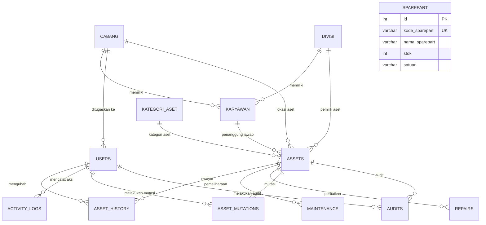

# Manual Database - Rekap IT (Sistem Manajemen Aset)

Dokumen ini berisi dokumentasi lengkap mengenai struktur database, relasi tabel, indeks optimasi, dan panduan penggunaan SQL untuk aplikasi **Rekap IT**.

---

## 1. Diagram Hubungan Entitas (ERD)

Berikut adalah visualisasi hubungan antar tabel dalam database `rekapit_momenthelp`:



---

## 2. Detail Struktur Tabel

### 2.1. Tabel Master Data

#### a. `cabang`
Menyimpan informasi kantor cabang perusahaan.
* **id** (`INT`, Primary Key, Auto Increment)
* **nama_cabang** (`VARCHAR(100)`, Not Null): Nama cabang (contoh: Cabang Jakarta, Cabang Bandung).
* **alamat** (`TEXT`): Alamat lengkap cabang.
* **created_at** (`TIMESTAMP`, Default: Current Timestamp)

#### b. `divisi`
Menyimpan informasi divisi/departemen di perusahaan.
* **id** (`INT`, Primary Key, Auto Increment)
* **nama_divisi** (`VARCHAR(100)`, Not Null): Nama divisi (contoh: IT, HRD, Finance).
* **created_at** (`TIMESTAMP`, Default: Current Timestamp)

#### c. `kategori_aset`
Kategori dari aset IT.
* **id** (`INT`, Primary Key, Auto Increment)
* **nama_kategori** (`VARCHAR(100)`, Not Null): Kategori aset (contoh: Laptop, PC, Router, Printer).
* **created_at** (`TIMESTAMP`, Default: Current Timestamp)

#### d. `karyawan`
Menyimpan data karyawan yang dapat memegang/menjadi penanggung jawab aset.
* **id** (`INT`, Primary Key, Auto Increment)
* **nama_karyawan** (`VARCHAR(100)`, Not Null)
* **nip** (`VARCHAR(50)`, Unique): Nomor Induk Pegawai.
* **id_cabang** (`INT`, Foreign Key ke `cabang.id`): Lokasi cabang karyawan ditempatkan.
* **id_divisi** (`INT`, Foreign Key ke `divisi.id`): Divisi karyawan.
* **jabatan** (`VARCHAR(100)`)
* **created_at** (`TIMESTAMP`, Default: Current Timestamp)

---

### 2.2. Tabel Utama Aset & Pengguna

#### a. `users`
Akun pengguna sistem (Admin & Teknisi).
* **id** (`INT`, Primary Key, Auto Increment)
* **nama** (`VARCHAR(100)`, Not Null): Nama lengkap pengguna.
* **username** (`VARCHAR(50)`, Unique, Not Null): Username login.
* **password** (`VARCHAR(255)`, Not Null): Hash password (menggunakan bcrypt).
* **role** (`ENUM('admin', 'teknisi')`, Default: 'teknisi')
* **id_cabang** (`INT`, Nullable, Foreign Key ke `cabang.id`)
* **created_at** (`TIMESTAMP`, Default: Current Timestamp)

#### b. `assets`
Data utama inventaris aset IT.
* **id** (`INT`, Primary Key, Auto Increment)
* **kode_aset** (`VARCHAR(50)`, Unique, Not Null): Kode unik aset (contoh: AST-2026-0001).
* **nama_aset** (`VARCHAR(100)`, Not Null): Nama perangkat.
* **serial_number** (`VARCHAR(100)`): Serial number dari manufaktur.
* **id_kategori** (`INT`, Foreign Key ke `kategori_aset.id`)
* **merk** (`VARCHAR(50)`)
* **model** (`VARCHAR(100)`)
* **tanggal_kadaluarsa_garansi** (`DATE`, Nullable)
* **id_cabang** (`INT`, Foreign Key ke `cabang.id`)
* **id_divisi** (`INT`, Foreign Key ke `divisi.id`)
* **id_karyawan** (`INT`, Foreign Key ke `karyawan.id`)
* **spesifikasi** (`TEXT`): Detail spesifikasi teknis (RAM, Processor, Storage, dll.).
* **kondisi** (`ENUM('Baik', 'Rusak Ringan', 'Rusak Berat')`, Default: 'Baik')
* **foto** (`VARCHAR(255)`): Path file foto aset.
* **created_at** (`TIMESTAMP`, Default: Current Timestamp)

---

### 2.3. Tabel Transaksional & Log Aktivitas

#### a. `asset_history`
Mencatat log perubahan setiap kolom pada tabel `assets` untuk audit trail.
* **id** (`INT`, Primary Key, Auto Increment)
* **asset_id** (`INT`, Foreign Key ke `assets.id`)
* **user_id** (`INT`, Foreign Key ke `users.id`)
* **field_changed** (`VARCHAR(100)`): Kolom/field yang diubah.
* **old_value** (`TEXT`): Nilai sebelum perubahan.
* **new_value** (`TEXT`): Nilai setelah perubahan.
* **created_at** (`TIMESTAMP`, Default: Current Timestamp)

#### b. `maintenance`
Pencatatan pemeliharaan preventif secara berkala oleh teknisi.
* **id** (`INT`, Primary Key, Auto Increment)
* **asset_id** (`INT`, Foreign Key ke `assets.id`)
* **tanggal** (`DATE`, Not Null): Tanggal perawatan dilakukan.
* **teknisi** (`VARCHAR(100)`): Nama teknisi yang bertugas.
* **temuan** (`TEXT`): Masalah atau temuan di lapangan.
* **tindakan** (`TEXT`): Aksi pemeliharaan yang dilakukan.
* **rekomendasi** (`TEXT`): Catatan rekomendasi selanjutnya.
* **status** (`ENUM('Baik', 'Perlu Perbaikan', 'Rusak')`, Default: 'Baik')
* **created_at** (`TIMESTAMP`, Default: Current Timestamp)

#### c. `repairs`
Pencatatan perbaikan aset yang mengalami kerusakan/keluhan.
* **id** (`INT`, Primary Key, Auto Increment)
* **asset_id** (`INT`, Foreign Key ke `assets.id`)
* **keluhan** (`TEXT`, Not Null): Kerusakan/masalah yang dilaporkan.
* **tindakan** (`TEXT`): Langkah perbaikan yang diambil.
* **biaya** (`DECIMAL(15,2)`, Default: 0.00): Biaya perbaikan.
* **status** (`ENUM('Proses', 'Selesai', 'Batal')`, Default: 'Proses')
* **tanggal_mulai** (`DATE`)
* **tanggal_selesai** (`DATE`)
* **created_at** (`TIMESTAMP`, Default: Current Timestamp)

#### d. `activity_logs`
Mencatat aktivitas user di dalam aplikasi secara umum (login, tambah data, hapus data).
* **id** (`INT`, Primary Key, Auto Increment)
* **user_id** (`INT`, Foreign Key ke `users.id`)
* **action** (`VARCHAR(50)`): Jenis tindakan (contoh: LOGIN, INSERT_ASSET).
* **description** (`TEXT`): Detail tindakan.
* **created_at** (`TIMESTAMP`, Default: Current Timestamp)

#### e. `asset_mutations`
Riwayat perpindahan aset antar Cabang, Divisi, atau Karyawan.
* **id** (`INT`, Primary Key, Auto Increment)
* **asset_id** (`INT`, Foreign Key ke `assets.id`)
* **user_id** (`INT`, Foreign Key ke `users.id`): Admin yang mengeksekusi mutasi.
* **id_cabang_lama**, **id_divisi_lama**, **id_karyawan_lama** (`INT`)
* **id_cabang_baru**, **id_divisi_baru**, **id_karyawan_baru** (`INT`)
* **tanggal_mutasi** (`DATE`, Not Null)
* **keterangan** (`TEXT`)
* **created_at** (`TIMESTAMP`, Default: Current Timestamp)

#### f. `audits`
Pencatatan hasil audit fisik aset di lapangan.
* **id** (`INT`, Primary Key, Auto Increment)
* **asset_id** (`INT`, Foreign Key ke `assets.id`)
* **user_id** (`INT`, Foreign Key ke `users.id`): Auditor (User yang melakukan verifikasi).
* **tanggal_audit** (`DATE`, Not Null)
* **kondisi_dilaporkan** (`ENUM('Baik', 'Rusak Ringan', 'Rusak Berat')`): Kondisi di database sebelum audit.
* **kondisi_fisik** (`ENUM('Baik', 'Rusak Ringan', 'Rusak Berat')`, Not Null): Kondisi riil setelah dicek.
* **lokasi_fisik** (`VARCHAR(100)`): Lokasi keberadaan aset saat diaudit.
* **catatan** (`TEXT`)
* **status_verifikasi** (`ENUM('Sesuai', 'Tidak Sesuai')`, Default: 'Sesuai')
* **created_at** (`TIMESTAMP`, Default: Current Timestamp)

#### g. `sparepart`
Manajemen suku cadang/sparepart pendukung pemeliharaan IT.
* **id** (`INT`, Primary Key, Auto Increment)
* **kode_sparepart** (`VARCHAR(50)`, Unique)
* **nama_sparepart** (`VARCHAR(100)`, Not Null)
* **stok** (`INT`, Default: 0)
* **satuan** (`VARCHAR(20)`)
* **created_at** (`TIMESTAMP`, Default: Current Timestamp)

---

## 3. Optimasi & Indeks Database

Untuk mempercepat query pencarian, filter, dan join tabel dengan volume data besar, indeks tambahan berikut telah diimplementasikan:

```sql
-- Indeks pada tabel assets untuk pencarian cabang, kondisi, dan tanggal
CREATE INDEX idx_assets_id_cabang ON assets(id_cabang);
CREATE INDEX idx_assets_kondisi ON assets(kondisi);
CREATE INDEX idx_assets_created_at ON assets(created_at);

-- Indeks pada tabel transaksional untuk mempercepat JOIN
CREATE INDEX idx_maintenance_asset_id ON maintenance(asset_id);
CREATE INDEX idx_repairs_asset_id ON repairs(asset_id);
```

---

## 4. Akun Default Awal (Default User)

Setelah database berhasil diinisialisasi menggunakan file `rekap_it.sql`, terdapat satu akun default dengan role administrator:
* **Username:** `admin`
* **Password:** `admin` *(Sudah di-hash dalam database)*
